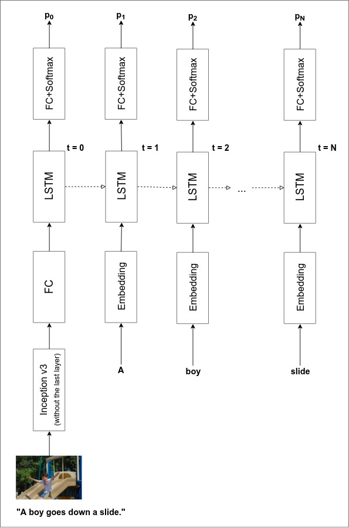

# Image Captioning Hackathon

We're going to implement image captioning along the lines of https://daniel.lasiman.com/post/image-captioning/ and the original [Vinyals et al](https://arxiv.org/abs/1411.4555) paper. Its worth reading both that blog post and the paper to get an idea of what we are planning to do.


We're going to use the Flickr8K Data set which has 8000 images. We'll split these into 6000 train set, 1000 validation set, and a 1000 demo set, where  we can put some up and make a demo.

There are two parts to this model, a convolutional part, where we'll take out 6000 images, pre-process them in the VGG16 or Inceptionv3 style, and run the network with frozen weights to get outputs. We'll remove the head of this network,and take the last layer and map it down to a 300 dimensional embedding.

This will be used in conjunction with the LSTM part, which is a 3-stack LSTM (1 will suffice for this project, but feel free to experiment), into which we also feed word embeddings of size 300. The entire architecture looks something like this, where we supply the entire image embedding at t=0, and then run a language model for our captions, the idea being that we'll start with one word in the caption, predict the next, and then slide the window over.




## Who ordered this?


The problem statement we want to solve is: *Given an image, find the most probable sequence of words (sentence) describing the image*. Fortunately, a deep learning model can be trained by directly maximizing the probability of the correct description given the image. 

In the training phase we want to find the best model’s parameters $\theta^*$ which satisfies:

$$\theta^* = \arg \max_{\theta} \sum_{(I, S)} \log p(S \mid I; \theta)$$

The probability of the correct caption $S$ given an image $I$ can be modeled as the joint probability over its words $S_0,…,S_N$:

$$\log p(S \mid I) = \sum_{t = 0}^N \log p_t(S_t \mid I, S_0, \dots, S_{t - 1})$$


where $N$ is the length of caption $S$, $S_N$ is a special end-of-sentence word (EOS), and the relationship between $S$ and $S_i$ is defined by:

$$S = \mathrm{Concatenate}(S_0, S_1, \dots, S_N)$$

We can use LSTM to model the joint probability distribution. Before that we need to encode images and captions into fixed-length dimensional vectors.

Using an LSTM we can model the joint probability distribution such that:

$$\mathrm{LSTM}_i = p_i$$

### Loss Function

One crucial step to do before we can train the model is to define a loss function. Since $LSTM_i=p_i$represents a probability distribution over all words, we can think of it as a multiclass classification where the number of classes equals the vocabulary’s size. Therefore, we can use a commonly used loss function for multiclass classification problems: [cross-entropy loss](https://cs231n.github.io/linear-classify/#softmax). The only difference is we need to aggregate all losses over the whole timesteps:

$$L(I, S) = - \sum_{t = 0}^N \log p_t(S_t)$$

where $p_t(S_t)$ represents the probability of word $S_t$ in distribution $p_t$.

In the codebase EOS is unnecessarily fed into the model so we have to discard timestep t=N+1 when calculating the loss.


## Steps

This is all a bit overwhelming so we'll approach this in 3 steps.

1. Preprocess these images according to VGG16. Freeze VGG16 weights and predict on these images. Note that this step requires an image processing pipeline
2. Preprocess the captions. Learn a Language model for the captions, by predicting the next word in the caption from the previous ones.
3. Remove the head of model 1 and learn a 300 dim embedding. Put this into the first word of the LSTM from 2 and predict.

We'll do Step 3 later, focussing today on Step 1 and 2


### Preprocessing needs

#### Images

We need to process the images according to the VGG specs. This should just be a `preprocess_input` function from the VGG. We used this architecture in the bottleneck part in the cats and dogs example.

Next we set up with image augmentation to predict on our files. We also did this in the cats and dogs example using augmentation (this was after we did the bottleneck)

```python
ImageDataGenerator(rotation_range=40,
                   width_shift_range=0.2,
                   height_shift_range=0.2,
                   shear_range=0.2,
                   zoom_range=0.2,
                   horizontal_flip=True,
                   fill_mode='nearest')
```

Once you have set up and had fun training  this model you will be ready for the next step

#### Captions

Do the usual pre-processing. (A) tokenizing (B) vocabulary creation (`vocab_size`) and both directional dictionary creation (C) sequence padding to `maxlen`. Now make a language model just with the captions, using words rather than characters.

Create a Generator for this just like with the images. It will come useful later.


